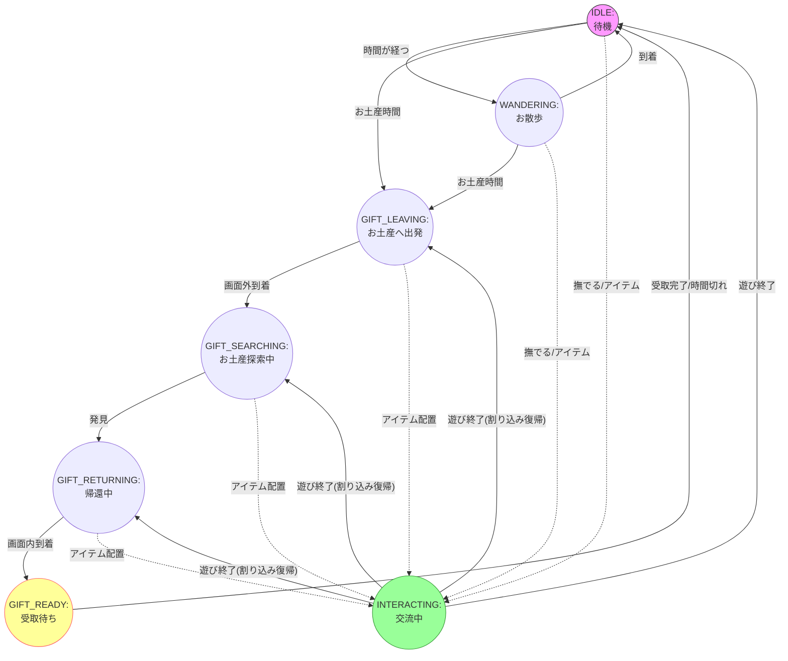

# Speaki ステートマシン（状態遷移）仕様

Speakiの行動ロジックはステートマシンで管理されています。
基本的には「待機」や「お散歩」を繰り返しますが、時間経過やユーザーの介入によって状態が遷移します。

## 状態一覧 (STATE)

- **IDLE (待機)**: 立ち止まっている状態。
- **WANDERING (お散歩)**: ランダムな地点へ移動中。
- **GIFT_LEAVING (お土産へ出発)**: お土産イベント発生。画面外へ向かう。
- **GIFT_SEARCHING (お土産探索中)**: 画面外で待機している時間。
- **GIFT_RETURNING (帰還中)**: お土産を持って画面中央へ戻る。
- **GIFT_READY (受取待ち)**: 帰還し、ユーザーが「受け取る」ボタンを押すのを待っている。
- **INTERACTING (交流中)**: ユーザーが撫でたり、アイテムを置いたりして遊んでいる状態。

## 状態遷移図

## 割り込みと復帰 (interruptedState)

ユーザーがアイテムを配置するなどして `INTERACTING` 状態に強制遷移する際、もし Speaki が「お土産イベント中（LEAVING, SEARCHING, RETURNING）」であれば、その状態を `interruptedState` プロパティに保存します。

`INTERACTING` が終了した際、`interruptedState` に値があればその状態に戻ります。これにより、「お使いの途中でもちょっと遊ぶ」挙動を実現しています。
